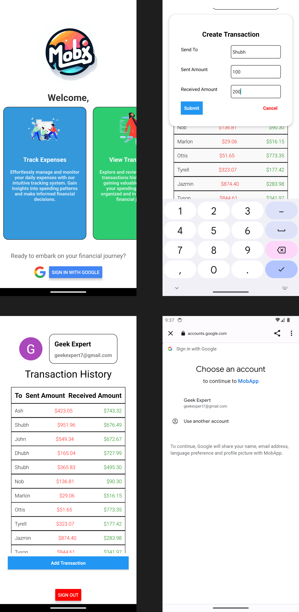

# Cross-Border Remittance App

## Overview

This mobile application prototype is built using React Native and Expo, focusing on cross-border remittance transfers. The app includes user authentication via Google OAuth and interacts with a mock API to simulate transactions and retrieve transaction history.

# Build Instructions

Follow these steps to build and run the Cross-Border Remittance App:

## Prerequisites

- [Git](https://git-scm.com/)
- [Node.js](https://nodejs.org/)
- [npm](https://www.npmjs.com/) (Node Package Manager)
- [Expo CLI](https://docs.expo.dev/get-started/installation/) (Install globally)

## Configuration
Add .env file to root directory with the following variables:
```
ANDROID_CLIENT_ID=YOUR_ANDROID_CLIENT_ID
WEB_CLIENT_ID=YOUR_WEB_CLIENT_ID
```
if you do not have a Google OAuth Client ID, follow the instructions [here](https://docs.expo.dev/versions/latest/sdk/google/).

## Steps
1. Clone repo
```
git clone https://github.com/tr1ten/MobApp.git
```


2. Install dependencies

Our app doesn't make use of any external libraries, apart from basic ones which can be installed using
```
npm install
```

3. Build and run app
```
expo run:android
```

# Screenshots



# Features

- **Google OAuth Integration**: Secure user authentication using Google OAuth.
- **Mock API Interaction**: Simulate transactions and retrieve transaction history with a mock API.
- **Easy-to-Use Transaction Page**: Simple input forms for quick and hassle-free transactions.

Feel free to explore and enhance the application further!